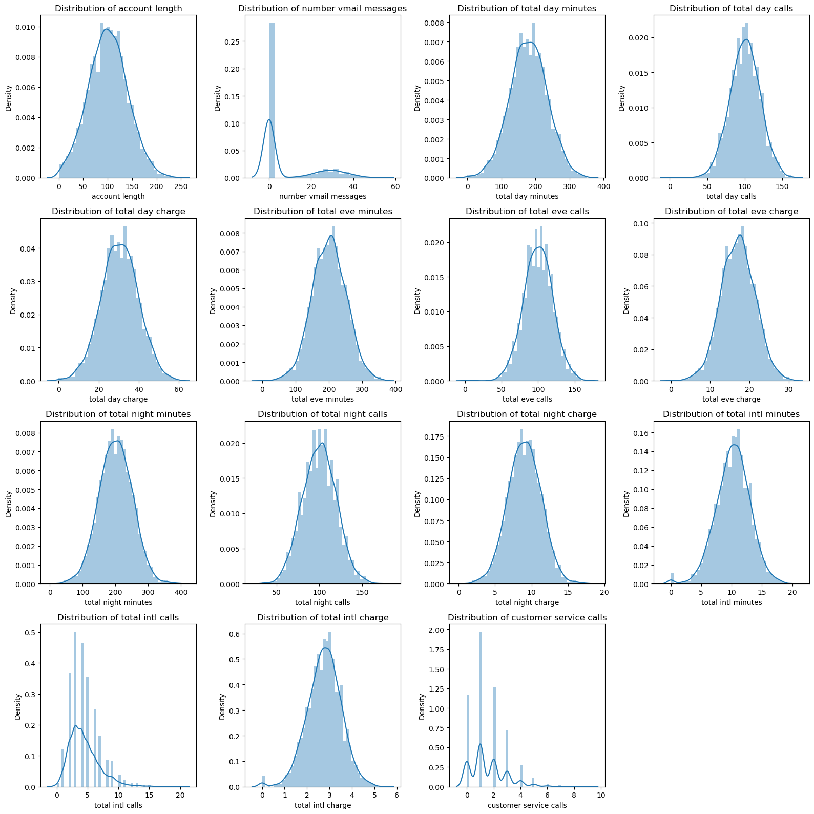
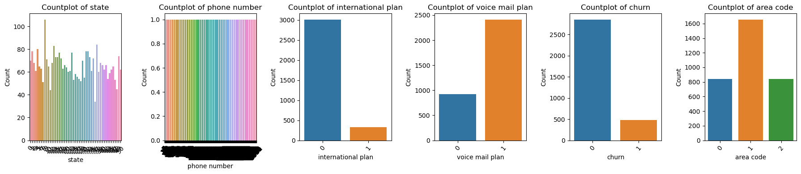
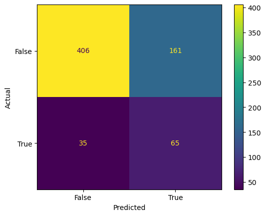
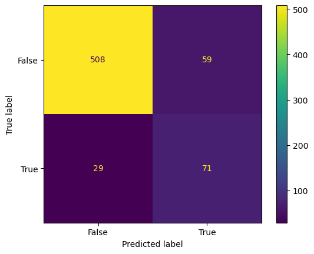
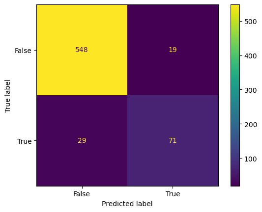
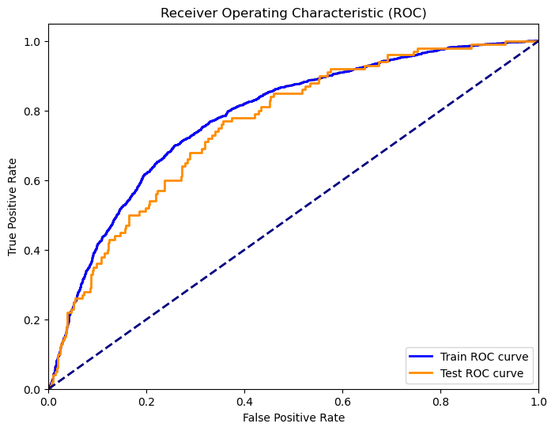
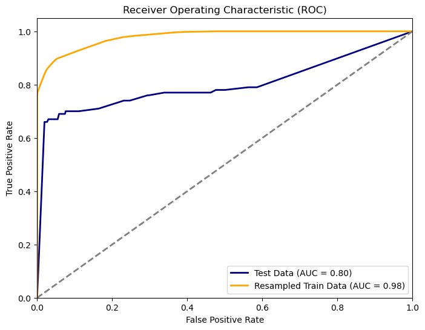
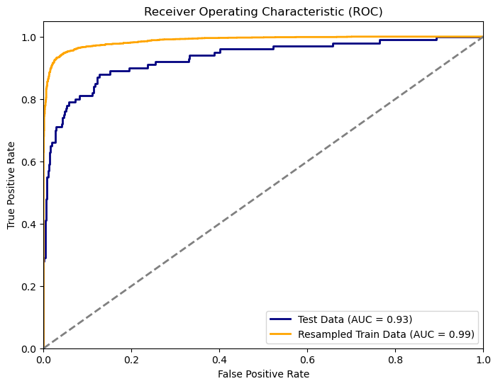
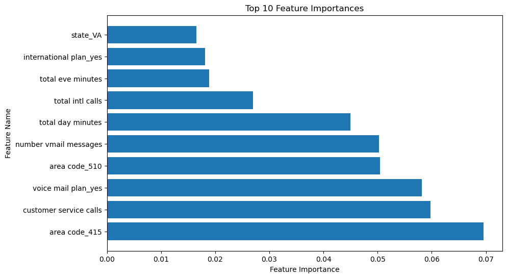
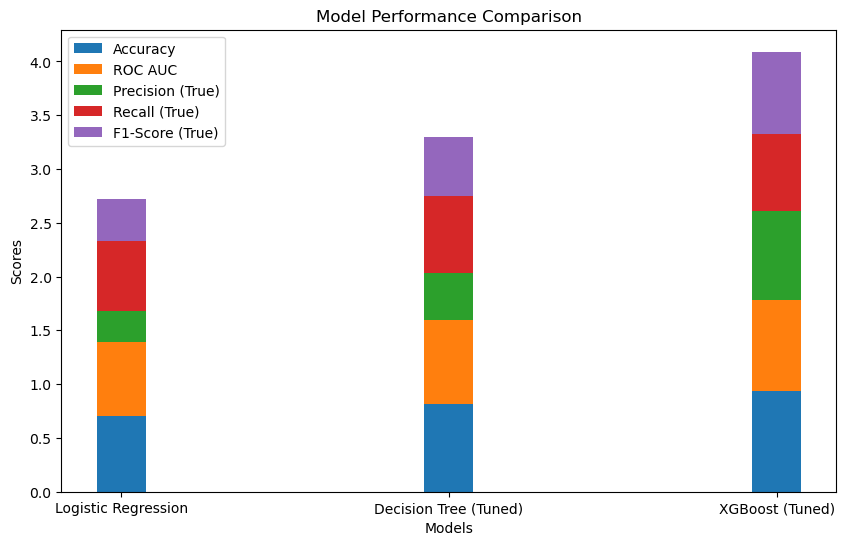

# Phase 3 Project:

## SyriaTel Customer Churn


---

### Contents

- [Overview](#overview)
- [Business and Data Understanding](#business-and-data-understanding)
- [Modeling](#modeling)
- [Evaluation](#evaluation)
- [Conclusion](#conclusion-and-recommendation)

## Overview

This project is focused on predicting customer churn for a telecom company. Customer churn, or attrition, is a crucial business challenge that can lead to a loss of revenue and market share. The goal of this project is to build predictive models that can identify customers at risk of churning, allowing the company to take proactive measures to retain them.

## Business and Data Understanding

This data set has 21 columns listed below:

1. state
2. account length
3. area code
4. phone number
5. international plan
6. voice mail plan
7. number vmail messages
8. total day minutes
9. total day calls
10. total day charge
11. total eve minutes
12. total eve calls
13. total eve charge
14. total night minutes
15. total night calls
16. total night charge
17. total intl minutes
18. total intl calls
19. total intl charge
20. customer service calls
21. churn

### Distribution plots



### Categorical data count plots



### Stakeholders

The success of the project is intrinsically tied to the satisfaction of a diverse set of stakeholders:

- **Syriatel Executives**: Leadership needs to maintain and expand their customer base, ensuring the long-term growth and sustainability of the company.
- **Syriatel Marketing Team**: The marketing department aims to increase customer acquisition, engagement, and the delivery of targeted promotions.
- **Syriatel Customer Support Team**: The customer support team seeks to provide efficient and effective customer service, resolving issues, and improving overall customer satisfaction.
- **Syriatel Customers**: The end-users, who expect reliable, affordable, and innovative telecommunications services.

### Dataset

We used the [Telecom Churn Dataset](https://www.kaggle.com/becksddf/churn-in-telecoms-dataset) for this analysis. The dataset contains (describe the key features and target variable).

## Modeling

We explored several machine learning models, including:

- Logistic Regression
- Random Forest
- Support Vector Machine
- Decision Tree
- AdaBoost Classifier
- Gradient Boosting Classifier
- XGBoost Classifier

## Evaluation

We evaluated the models using various metrics, including accuracy, ROC AUC, precision, recall, and F1-score. The following table summarizes the performance of each model:

| Model                 | Accuracy | ROC AUC | Precision (True) | Recall (True) | F1-Score (True) |
| --------------------- | -------- | ------- | ---------------- | ------------- | --------------- |
| Logistic Regression   | 0.706    | 0.683   | 0.287611         | 0.65          | 0.398773        |
| Decision Tree (Tuned) | 0.818    | 0.778   | 0.436364         | 0.72          | 0.543396        |
| XGBoost (Tuned)       | 0.935    | 0.843   | 0.835294         | 0.71          | 0.767568        |

### Visualizations

Here are some data visualizations:

### Confusion Matrices

#### Logistic Regression Model



#### Decision Tree - tuned



#### XGB Model - tuned



### Receiver Operating Characteristic (ROC) Curves

#### 1. Logistic Regression Model ROC curve



#### 2. Decision Tree Model ROC curve



#### 3. XGB Model ROC curve



#### Feature Importance



#### Model performances:



## Modelling Summary

In this project, we tackled a critical issue for a telecommunications company – customer churn. By leveraging predictive modeling techniques and machine learning, we aimed to build a model that could effectively identify customers who are at risk of churning. Using a real-world dataset, we employed various data preprocessing, resampling, and modeling techniques to create models that could predict customer churn accurately.

**Findings:**

- We explored and visualized the dataset, revealing key insights into the distributions and relationships of the variables.
- We implemented various resampling techniques, including SMOTE, to address class imbalance and evaluated their impact on model performance.
- We constructed and fine-tuned models, including logistic regression, decision trees, and an XGBoost classifier, optimizing hyperparameters to enhance model performance.
- We assessed model performance using key classification metrics, such as accuracy, ROC AUC, precision, recall, and F1-score.
- The XGBoost model outperformed other models, demonstrating the highest accuracy and ROC AUC.

## Conclusion and Recommendation:

In conclusion, our predictive modeling approach shows promise in addressing the challenge of customer churn in the telecommunications industry. We have successfully developed models that can identify customers at risk of churning. The XGBoost model, with tuned hyperparameters, emerged as the top-performing model, achieving high accuracy and ROC AUC.

### Recommendations:

1. **Deployment of the XGBoost Model:** We recommend deploying the XGBoost model to the company's operational systems to monitor customers' likelihood of churn in real time. This would enable timely interventions to retain at-risk customers.

2. **Customer Service Focus:** Our findings suggest that the number of customer service calls is a crucial feature. Consider focusing on improving the customer service experience to reduce customer churn.

3. **Voice Mail Plans:** Customers with voice mail plans are more likely to churn. Explore reasons behind this trend and consider tailoring plans to meet customer needs.

4. **Regular Model Updates:** Periodic updates to the model with new data can help maintain its predictive accuracy. Reevaluate and recalibrate the model as needed.

5. **Feedback Loop:** Establish a feedback loop between model predictions and the customer retention team. This will allow them to gather insights from customer interactions and further refine retention strategies.

6. **Exploratory Data Analysis:** Continue to explore the dataset to understand the dynamics of customer churn. Investigate other potentially influential features and analyze them further.

Incorporating these recommendations can significantly help the telecommunications company in reducing customer churn, increasing customer retention, and ultimately boosting business performance.

The following is the pickled version of our final model.

## Data Sources

- [SyriaTel Churn Dataset](https://www.kaggle.com/becksddf/churn-in-telecoms-dataset)

## Tools: ⚙️

To run the analysis, you'll need the following:

- python3 (3.8.5)
- conda 4.10.3 (Jupyter Notebook)
- Libraries: pandas, numpy, matplotlib, seaborn, scikit-learn

## Authors: 🖋️

- [Fredrick Kyeki](https://github.com/FREDRICKKYEKI)

## Repository Structure: 📁

```
├── README.md <- The top-level README for reviewers of this project
├── index.ipynb <- Narrative documentation of analysis in Jupyter notebook
├── presentation.pdf <- PDF version of project presentation
├── notebook.pdf <- PDF version of the notebook
└── images <- Both sourced externally and generated from code
```
